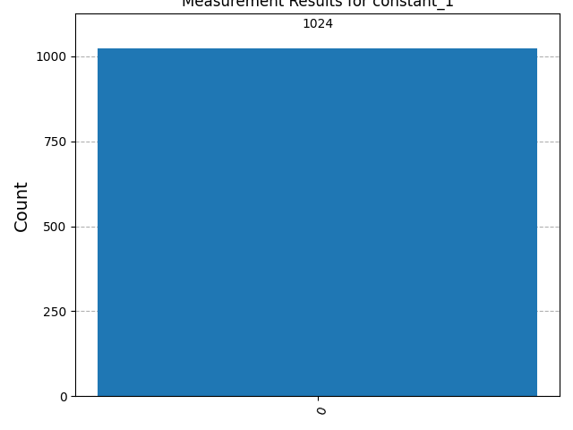

# Deutsch's Algorithm Implementation

This project implements **Deutsch's Algorithm**, one of the first quantum algorithms demonstrating quantum advantage over classical computation. It determines whether a Boolean function is constant or balanced using just one quantum query, compared to the classical requirement of two queries.

## Table of Contents

- [Overview](#overview)
- [Algorithm Explanation](#algorithm-explanation)
- [Features](#features)
- [Installation](#installation)
- [Usage](#usage)
- [Results](#results)
- [Extensions](#extensions)
- [Contributing](#contributing)
- [License](#license)

## Overview

Deutsch's Algorithm is a quantum algorithm that solves the problem of identifying whether a Boolean function \(f: \{0,1\} \to \{0,1\}\) is constant (same output for both inputs) or balanced (different outputs) with a single evaluation of the function in superposition.

This implementation uses Qiskit for quantum circuit simulation and includes:
- Basic Deutsch's Algorithm for 1-bit functions
- Noise model testing for robustness
- Performance analysis with multiple runs
- Extension to Deutsch-Jozsa Algorithm for multi-bit functions
- Visualization of measurement results

## Algorithm Explanation

### Classical Approach
To determine if \(f\) is constant or balanced classically:
1. Query \(f(0)\)
2. Query \(f(1)\)
3. Compare results: if equal, constant; else, balanced

**Complexity**: 2 queries

### Quantum Approach (Deutsch's Algorithm)
1. Prepare superposition: \(|01\rangle\)
2. Apply Hadamard gates for interference
3. Apply oracle \(U_f\) that encodes the function
4. Apply Hadamard and measure
5. Result: '0' for constant, '1' for balanced

**Complexity**: 1 query

The quantum advantage comes from superposition and interference, allowing the algorithm to "see" both function values simultaneously.

## Features

- ✅ Complete implementation of Deutsch's Algorithm
- ✅ Support for all 4 possible Boolean functions
- ✅ Noise model testing for quantum error simulation
- ✅ Performance benchmarking with statistical analysis
- ✅ Visualization of quantum measurement histograms
- ✅ Extension to Deutsch-Jozsa Algorithm for n-bit functions
- ✅ Modular code structure for easy extension

## Installation

1. Clone the repository:
```bash
git clone https://github.com/Guna-Asher/deutsch-algorithm.git
cd deutsch-algorithm
```

2. Install dependencies:
```bash
pip install -r requirements.txt
```

Requirements:
- qiskit
- qiskit-aer
- matplotlib

## Usage

Run the main script:
```bash
python deutsch_algorithm.py
```

This will execute:
- Basic tests for all oracle types
- Noise model simulations
- Performance testing (100 runs per oracle)
- Deutsch-Jozsa algorithm demonstration
- Generate histogram images

## Results

The algorithm correctly identifies function types with 100% accuracy in ideal conditions.

### Measurement Histograms

#### Constant Function f(0)=0, f(1)=0


#### Constant Function f(0)=1, f(1)=1


#### Balanced Function f(0)=0, f(1)=1


#### Balanced Function f(0)=1, f(1)=0


### Performance Results

- **Success Rate**: 100% across all oracle types
- **Noise Resilience**: Maintains accuracy with 1% depolarizing noise
- **Deutsch-Jozsa Extension**: Correctly handles 3-bit functions

## Extensions

### Deutsch-Jozsa Algorithm

The code includes an extension to the Deutsch-Jozsa Algorithm, which generalizes Deutsch's Algorithm to n-bit Boolean functions:

- **Constant**: All inputs map to same output
- **Balanced**: Exactly half inputs map to 0, half to 1

The quantum algorithm determines this in O(1) queries vs. O(2^{n-1}) classically.

## Contributing

Contributions are welcome! Please:

1. Fork the repository
2. Create a feature branch
3. Add tests for new functionality
4. Submit a pull request


---

**Note**: This implementation is for educational purposes and demonstrates fundamental quantum computing concepts. For production use, consider using actual quantum hardware through IBM Quantum Experience.


